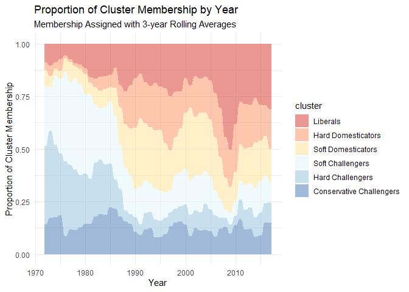

# 1) Library

``` r
pacman::p_load(tidyverse,tidytext, magrittr, zoo, ggalluvial)
set.seed(42)
```

# 2) Load Data

``` r
# Load un_long ----
un_long <- read_csv("un_long.csv", col_types = cols(...1 = col_skip()))
```

    ## New names:
    ## * `` -> `...1`

# Compute cluster membership at 3,5,7 year rolling means

``` r
# Compute cluster membership at 3,5,7 year rolling means ----
un_roll357 <- un_long %>% 
  group_by(iso, year, sourcetext) %>% 
  mutate(iso_year_source_mean = mean(value)) %>% 
  select(iso,year, sourcetext, iso_year_source_mean) %>%
  unique() %>% 
  group_by(iso, sourcetext) %>%
  mutate(roll3 = rollmean(iso_year_source_mean, k = 3, fill = NA)) %>% 
  mutate(roll5 = rollmean(iso_year_source_mean, k = 5, fill = NA)) %>% 
  mutate(roll7 = rollmean(iso_year_source_mean, k = 7, fill = NA))

# 3 year ----
figure3a_data <- un_roll357 %>% 
  select(-roll5,-roll7) %>%
  drop_na() %>%
  group_by(iso,year) %>% 
  arrange(roll3,.by_group = TRUE) %>% 
  mutate(sourceorder_ascending = paste(sourcetext, collapse = ",")) %>% 
  ungroup() %>% 
  select(iso,year,sourceorder_ascending) %>% 
  unique() %>% 
  mutate(cluster = case_when(
    sourceorder_ascending == "nieo,brandt1,reagan" ~ "Liberals",
    sourceorder_ascending == "nieo,reagan,brandt1" ~  "Hard Domesticators",
    sourceorder_ascending == "reagan,nieo,brandt1"~ "Soft Domesticators",
    sourceorder_ascending == "reagan,brandt1,nieo" ~ "Soft Challengers",
    sourceorder_ascending == "brandt1,reagan,nieo" ~ "Hard Challengers",
    sourceorder_ascending == "brandt1,nieo,reagan"~ "Conservative Challengers")) %>% 
  ungroup() %>% 
  select(iso,year,cluster) %>% 
  group_by(year) %>% 
  count(cluster) %>% 
  mutate(n_total = sum(n)) %>% 
  mutate(cluster_proportion = n/n_total)

# Add factor levels to clusters 
figure3a_data$cluster <- factor(figure3a_data$cluster, levels = c("Liberals", "Hard Domesticators", "Soft Domesticators", "Soft Challengers", "Hard Challengers", "Conservative Challengers"))

# Generate figure
figure3a_plot <- figure3a_data %>% 
  ggplot(mapping = aes(x = year, y = cluster_proportion, fill = cluster)) +
  geom_bar(stat = "identity") +
  scale_fill_brewer(palette = "RdYlBu") + 
  labs(title = "Proportion of Cluster Membership by Year", subtitle = "Membership Assigned with 3-year Rolling Averages") + 
  xlab("Year") + 
  ylab("Proportion of Cluster Membership")

# 5 year ----
figure3b_data <- un_roll357 %>% 
  select(-roll3,-roll7) %>%
  drop_na() %>%
  group_by(iso,year) %>% 
  arrange(roll5,.by_group = TRUE) %>% 
  mutate(sourceorder_ascending = paste(sourcetext, collapse = ",")) %>% 
  ungroup() %>% 
  select(iso,year,sourceorder_ascending) %>% 
  unique() %>% 
  mutate(cluster = case_when(
    sourceorder_ascending == "nieo,brandt1,reagan" ~ "Liberals",
    sourceorder_ascending == "nieo,reagan,brandt1" ~  "Hard Domesticators",
    sourceorder_ascending == "reagan,nieo,brandt1"~ "Soft Domesticators",
    sourceorder_ascending == "reagan,brandt1,nieo" ~ "Soft Challengers",
    sourceorder_ascending == "brandt1,reagan,nieo" ~ "Hard Challengers",
    sourceorder_ascending == "brandt1,nieo,reagan"~ "Conservative Challengers")) %>% 
  ungroup() %>% 
  select(iso,year,cluster) %>% 
  group_by(year) %>% 
  count(cluster) %>% 
  mutate(n_total = sum(n)) %>% 
  mutate(cluster_proportion = n/n_total)

# Add factor levels to clusters 
figure3b_data$cluster <- factor(figure3b_data$cluster, levels = c("Liberals", "Hard Domesticators", "Soft Domesticators", "Soft Challengers", "Hard Challengers", "Conservative Challengers"))

# Generate figure
figure3b_plot <- figure3b_data %>% 
  ggplot(mapping = aes(x = year, y = cluster_proportion, fill = cluster)) +
  geom_bar(stat = "identity") +
  scale_fill_brewer(palette = "RdYlBu") + 
  labs(title = "Proportion of Cluster Membership by Year", subtitle = "Membership Assigned with 5-year Rolling Averages") + 
  xlab("Year") + 
  ylab("Proportion of Cluster Membership")

# 7 year ----
figure3c_data <- un_roll357 %>% 
  select(-roll3,-roll5) %>%
  drop_na() %>%
  group_by(iso,year) %>% 
  arrange(roll7,.by_group = TRUE) %>% 
  mutate(sourceorder_ascending = paste(sourcetext, collapse = ",")) %>% 
  ungroup() %>% 
  select(iso,year,sourceorder_ascending) %>% 
  unique() %>% 
  mutate(cluster = case_when(
    sourceorder_ascending == "nieo,brandt1,reagan" ~ "Liberals",
    sourceorder_ascending == "nieo,reagan,brandt1" ~  "Hard Domesticators",
    sourceorder_ascending == "reagan,nieo,brandt1"~ "Soft Domesticators",
    sourceorder_ascending == "reagan,brandt1,nieo" ~ "Soft Challengers",
    sourceorder_ascending == "brandt1,reagan,nieo" ~ "Hard Challengers",
    sourceorder_ascending == "brandt1,nieo,reagan"~ "Conservative Challengers")) %>% 
  ungroup() %>% 
  select(iso,year,cluster) %>% 
  group_by(year) %>% 
  count(cluster) %>% 
  mutate(n_total = sum(n)) %>% 
  mutate(cluster_proportion = n/n_total)

# Add factor levels to clusters 
figure3c_data$cluster <- factor(figure3c_data$cluster, levels = c("Liberals", "Hard Domesticators", "Soft Domesticators", "Soft Challengers", "Hard Challengers", "Conservative Challengers"))

# Generate figure
figure3c_plot <- figure3c_data %>% 
  ggplot(mapping = aes(x = year, y = cluster_proportion, fill = cluster)) +
  geom_bar(stat = "identity") +
  scale_fill_brewer(palette = "RdYlBu") + 
  labs(title = "Proportion of Cluster Membership by Year", subtitle = "Membership Assigned with 7-year Rolling Averages") + 
  xlab("Year") + 
  ylab("Proportion of Cluster Membership")
```

# Plot figures

``` r
# Figure 3a - 3 year rolling means ----
figure3a_plot
```

<!-- -->

``` r
# Figure 3b - 5 year rolling means ----
figure3b_plot
```

<!-- -->

``` r
# Figure 3c - 7 year rolling means ----
figure3c_plot
```

<!-- -->

# Alluvial figure

``` r
figure3_alluvium <- figure3a_data %>% 
  ggplot(mapping = aes(x = year, alluvium = cluster, y = cluster_proportion, fill = cluster)) +
  geom_alluvium(aes(fill = cluster)) +
  scale_fill_brewer(palette = "RdYlBu") + 
  labs(title = "Proportion of Cluster Membership by Year", subtitle = "Membership Assigned with 3-year Rolling Averages") + 
  xlab("Year") + 
  ylab("Proportion of Cluster Membership") +
  theme_minimal()

figure3_alluvium  
```

<!-- -->
