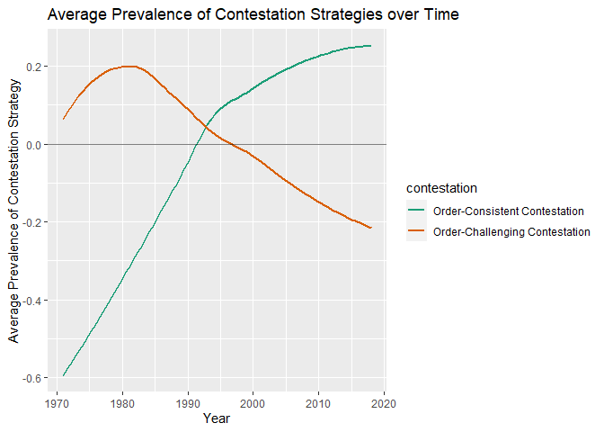

# 1) Library

``` r
pacman::p_load(tidyverse,tidytext, magrittr)
set.seed(42)
```

# 2) Load Data

``` r
# Load un_long ----
un_long <- read_csv("un_long.csv", col_types = cols(...1 = col_skip()))
```

    ## New names:
    ## * `` -> ...1

# 3) Add “contestation” variables

``` r
# Add rhetorical strategy variable ----
contestation_data <- un_long %>% 
  mutate(contestation = case_when(
    cmd == "domesticeconomicefficiency" ~ "Order-Consistent Contestation",
    cmd == "primaryresponsibilityfordevelopment" ~ "Order-Consistent Contestation",
    cmd == "raisingproductivity" ~ "Order-Consistent Contestation",
    cmd == "soundeconomicpolicies" ~ "Order-Consistent Contestation",
    
    cmd == "developmentaid" ~ "Order-Consistent Contestation",
    cmd == "escapingfrompoverty" ~ "Order-Consistent Contestation",
    cmd == "justandhumanesociety" ~ "Order-Consistent Contestation",
    cmd == "spiritofpartnership" ~ "Order-Consistent Contestation",
    
    cmd == "freemarketeconomy" ~ "Order-Consistent Contestation",
    cmd == "privatecapitalflows" ~ "Order-Consistent Contestation",
    cmd == "stimulategrowth" ~ "Order-Consistent Contestation",
    cmd == "tradeopportunities" ~ "Order-Consistent Contestation",
    
    cmd == "gapbetweenrichandpoorcountries" ~ "Order-Challenging Contestation",
    cmd == "neocolonialism" ~ "Order-Challenging Contestation",
    cmd == "prevailingdisparities" ~ "Order-Challenging Contestation",
    cmd == "unsatisfactorytermsoftrade" ~ "Order-Challenging Contestation",
    
    cmd == "aliendomination" ~ "Order-Challenging Contestation",
    cmd == "selfdetermination" ~ "Order-Challenging Contestation",
    cmd == "sovereignequality" ~ "Order-Challenging Contestation",
    cmd == "subordination" ~ "Order-Challenging Contestation", 
    
    TRUE ~ "drop"
  ))

contestation_data %<>% filter(contestation != "drop")

contestation_data$contestation <- factor(contestation_data$contestation, levels = c("Order-Consistent Contestation", "Order-Challenging Contestation"))
```

# generate figure

``` r
# contestation figure ----

contestation_figure <- contestation_data %>% 
  group_by(year, contestation) %>% 
  summarise(mean_contestation = mean(value)) %>% 
  ggplot(mapping = aes(x = year, y = mean_contestation, colour = contestation)) +
  scale_colour_brewer(palette = "Dark2") +
  geom_smooth(se=FALSE) +
  geom_hline(alpha = 0.5, yintercept = 0) +
  labs(title = "Average Prevalence of Contestation Strategies over Time") +
  xlab("Year") + 
  ylab("Average Prevalence of Contestation Strategy")
```

    ## `summarise()` has grouped output by 'year'. You can override using the `.groups` argument.

# print figure

``` r
contestation_figure
```

    ## `geom_smooth()` using method = 'loess' and formula 'y ~ x'

<!-- -->
