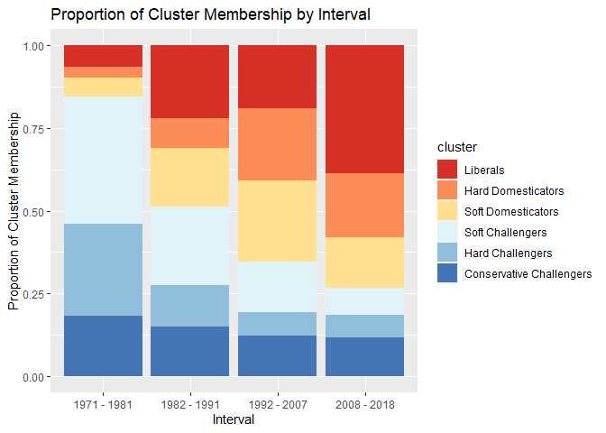

# OVERVIEW

## This file contains the replication materials for figure 3

1)  Load necessary packages
2)  Load `un_long`
3)  Compute cluster membership
4)  Plot cluster membership by interval

# 1) Library

``` r
pacman::p_load(tidyverse,tidytext, magrittr)
set.seed(42)
```

# 2) Load Data

``` r
# Load un_long ----
un_long <- read_csv("un_long.csv", col_types = cols(...1 = col_skip()))
```

    ## New names:
    ## * `` -> ...1

# 3) Compute cluster membership

``` r
# Add interval variable ----
un_long %<>%
  mutate(interval = case_when(
    year <= 1981 ~ "1971 - 1981",
    year >= 1982 & year <= 1991 ~ "1982 - 1991",
    year >= 1992 & year <= 2007 ~ "1992 - 2007",
    year >= 2008 ~ "2008 - 2018"
  ))

# Compute cluster membership ----
figure3_data <- un_long %>% 
  group_by(iso, interval, sourcetext) %>% 
  mutate(iso_int_source_mean = mean(value)) %>% 
  select(iso,interval, sourcetext, iso_int_source_mean) %>%
  unique() %>% 
  group_by(iso, interval) %>% 
  arrange(iso_int_source_mean,.by_group = TRUE) %>% 
  mutate(sourceorder_ascending = paste(sourcetext, collapse = ",")) %>% 
  ungroup() %>% 
  select(iso,interval,sourceorder_ascending) %>% 
  unique() %>% 
  mutate(cluster = case_when(
    sourceorder_ascending == "nieo,brandt1,reagan" ~ "Liberals",
    sourceorder_ascending == "nieo,reagan,brandt1" ~  "Hard Domesticators",
    sourceorder_ascending == "reagan,nieo,brandt1"~ "Soft Domesticators",
    sourceorder_ascending == "reagan,brandt1,nieo" ~ "Soft Challengers",
    sourceorder_ascending == "brandt1,reagan,nieo" ~ "Hard Challengers",
    sourceorder_ascending == "brandt1,nieo,reagan"~ "Conservative Challengers")) %>% 
  ungroup() %>% 
  select(iso,interval,cluster) %>% 
  group_by(interval) %>% 
  count(cluster) %>% 
  mutate(n_total = sum(n)) %>% 
  mutate(cluster_proportion = n/n_total)

# Add factor levels to clusters ----
figure3_data$cluster <- factor(figure3_data$cluster, levels = c("Liberals", "Hard Domesticators", "Soft Domesticators", "Soft Challengers", "Hard Challengers", "Conservative Challengers"))

# Generate plot ----
figure3_plot <- figure3_data %>% 
  ggplot(mapping = aes(x = interval, y = cluster_proportion, fill = cluster)) +
  geom_bar(stat = "identity") +
  scale_fill_brewer(palette = "RdYlBu") + 
  labs(title = "Proportion of Cluster Membership by Interval") + 
  xlab("Interval") + 
  ylab("Proportion of Cluster Membership")
```

# 4) Figure 3 plot

``` r
figure3_plot
```

<!-- -->
