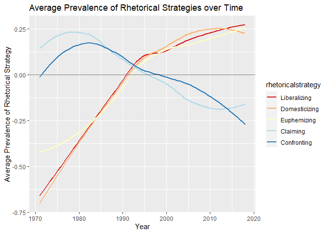
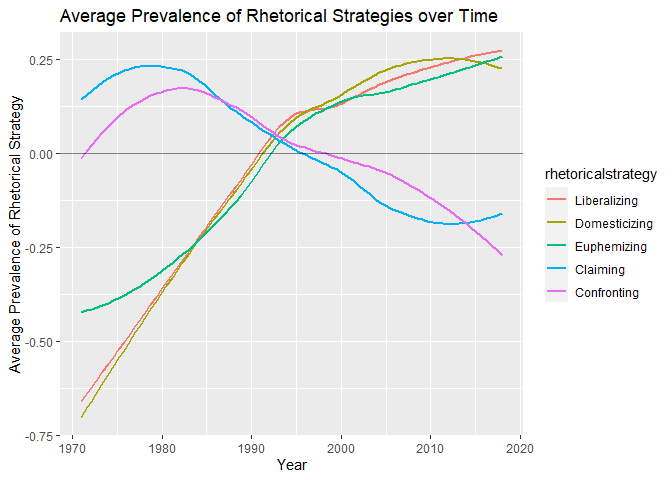

# 1) Library

``` r
pacman::p_load(tidyverse,tidytext, magrittr)
set.seed(42)
```

# 2) Load Data

``` r
# Load un_long ----
un_long <- read_csv("un_long.csv", col_types = cols(...1 = col_skip()))
```

    ## New names:
    ## * `` -> ...1

# 3) Add “rhetorical strategy” variable

``` r
# Add rhetorical strategy variable ----
figure4_data <- un_long %>% 
  mutate(rhetoricalstrategy = case_when(
    cmd == "domesticeconomicefficiency" ~ "Domesticizing",
    cmd == "primaryresponsibilityfordevelopment" ~ "Domesticizing",
    cmd == "raisingproductivity" ~ "Domesticizing",
    cmd == "soundeconomicpolicies" ~ "Domesticizing",
    
    cmd == "developmentaid" ~ "Euphemizing",
    cmd == "escapingfrompoverty" ~ "Euphemizing",
    cmd == "justandhumanesociety" ~ "Euphemizing",
    cmd == "spiritofpartnership" ~ "Euphemizing",
    
    cmd == "freemarketeconomy" ~ "Liberalizing",
    cmd == "privatecapitalflows" ~ "Liberalizing",
    cmd == "stimulategrowth" ~ "Liberalizing",
    cmd == "tradeopportunities" ~ "Liberalizing",
    
    cmd == "gapbetweenrichandpoorcountries" ~ "Confronting",
    cmd == "neocolonialism" ~ "Confronting",
    cmd == "prevailingdisparities" ~ "Confronting",
    cmd == "unsatisfactorytermsoftrade" ~ "Confronting",
    
    cmd == "aliendomination" ~ "Claiming",
    cmd == "selfdetermination" ~ "Claiming",
    cmd == "sovereignequality" ~ "Claiming",
    cmd == "subordination" ~ "Claiming", 
    
    TRUE ~ "drop"
  ))

figure4_data %<>% filter(rhetoricalstrategy != "drop")

figure4_data$rhetoricalstrategy <- factor(figure4_data$rhetoricalstrategy, levels = c("Liberalizing", "Domesticizing", "Euphemizing", "Claiming", "Confronting"))
```

# 4) Figures for Rhetorical Strategies

2 different color schemes

``` r
figure4_color1 <- figure4_data %>% 
  group_by(year, rhetoricalstrategy) %>% 
  summarise(mean_rhetoricalstrategy = mean(value)) %>% 
  ggplot(mapping = aes(x = year, y = mean_rhetoricalstrategy, colour = rhetoricalstrategy)) +
  scale_colour_brewer(palette = "RdYlBu") +
  geom_smooth(se=FALSE) +
  geom_hline(alpha = 0.5, yintercept = 0) +
  labs(title = "Average Prevalence of Rhetorical Strategies over Time") +
  xlab("Year") + 
  ylab("Average Prevalence of Rhetorical Strategy")
```

    ## `summarise()` has grouped output by 'year'. You can override using the `.groups` argument.

``` r
figure4_color2 <- figure4_data %>% 
  group_by(year, rhetoricalstrategy) %>% 
  summarise(mean_rhetoricalstrategy = mean(value)) %>% 
  ggplot(mapping = aes(x = year, y = mean_rhetoricalstrategy, colour = rhetoricalstrategy)) +
  geom_smooth(se=FALSE) +
  geom_hline(alpha = 0.5, yintercept = 0) +
  labs(title = "Average Prevalence of Rhetorical Strategies over Time") +
  xlab("Year") + 
  ylab("Average Prevalence of Rhetorical Strategy")
```

    ## `summarise()` has grouped output by 'year'. You can override using the `.groups` argument.

# 5) Print figures

``` r
#  figure4_color1 ----

figure4_color1 
```

    ## `geom_smooth()` using method = 'loess' and formula 'y ~ x'

<!-- -->

``` r
# figure4_color2 ----

figure4_color2 
```

    ## `geom_smooth()` using method = 'loess' and formula 'y ~ x'

<!-- -->
