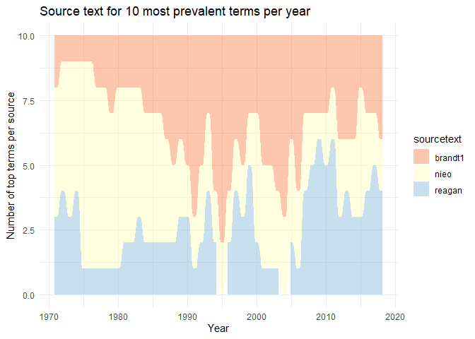

# Overview:

The conclusions that we draw from the network plots are in some ways
redundant with figure 3. Where there isn’t overlap is with “centrality”,
but we don’t really explain what this means. Also, we reference the
source of tropes form these clusters, but we don’t illustrate them in an
intuitive manner.

# 1) Library

``` r
pacman::p_load(tidyverse,tidytext, magrittr, zoo, ggalluvial)
set.seed(42)
```

# 2) Load Data

``` r
# Load un_long ----
un_long <- read_csv("un_long.csv", col_types = cols(...1 = col_skip()))
```

    ## New names:
    ## * `` -> `...1`

# 3) Add cluster attributes

``` r
# Compute clustering ----
iso_year_cluster <- un_long %>% 
  group_by(iso,year,sourcetext) %>% 
  summarise(iso_year_source_mean = mean(value)) %>% 
  ungroup() %>% 
  group_by(iso, year) %>% 
  arrange(iso_year_source_mean,.by_group = TRUE) %>%
  mutate(sourceorder_ascending = paste(sourcetext, collapse = ",")) %>%
  ungroup() %>% 
  mutate(cluster = case_when(
    sourceorder_ascending == "nieo,brandt1,reagan" ~ "Liberals",
    sourceorder_ascending == "nieo,reagan,brandt1" ~  "Hard Domesticators",
    sourceorder_ascending == "reagan,nieo,brandt1"~ "Soft Domesticators",
    sourceorder_ascending == "reagan,brandt1,nieo" ~ "Soft Challengers",
    sourceorder_ascending == "brandt1,reagan,nieo" ~ "Hard Challengers",
    sourceorder_ascending == "brandt1,nieo,reagan"~ "Conservative Challengers")) %>%
  ungroup() %>% 
  select(iso, year, cluster) %>% 
  unique()
```

    ## `summarise()` has grouped output by 'iso', 'year'. You can override using the
    ## `.groups` argument.

``` r
# Add to un_long ----
un_long %<>% left_join(iso_year_cluster)
```

    ## Joining, by = c("iso", "year")

``` r
# clean up
rm(iso_year_cluster)
```

# 4)

``` r
cmd_sourcetext = un_long %>% 
  select(cmd, sourcetext) %>% 
  unique()

figure4_networkalternative <- un_long %>% 
  group_by(year, cmd) %>% 
  summarize(year_cmd.mean = mean(value)) %>% 
  ungroup() %>% 
  group_by(year) %>% 
  slice_max(year_cmd.mean,n = 10) %>% 
  left_join(cmd_sourcetext) %>% 
  ungroup() %>% 
  group_by(year) %>% 
  count(sourcetext) %>% 
  ggplot(mapping = aes(x = year, alluvium = sourcetext,  y = n, fill = sourcetext)) + 
  geom_alluvium(aes(fill = sourcetext)) +
  scale_fill_brewer(palette = "RdYlBu") + 
  theme_minimal() + 
  labs(title = "Source text for 10 most prevalent terms per year") + 
  xlab("Year") + 
  ylab("Number of top terms per source")
```

    ## `summarise()` has grouped output by 'year'. You can override using the
    ## `.groups` argument.
    ## Joining, by = "cmd"

``` r
figure4_networkalternative
```

<!-- -->
