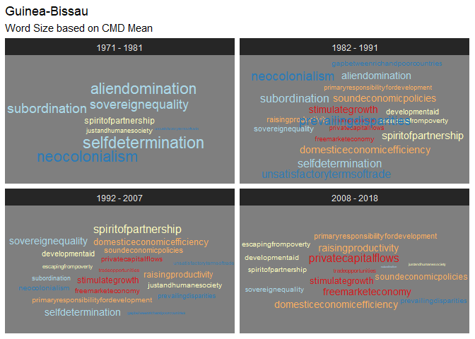
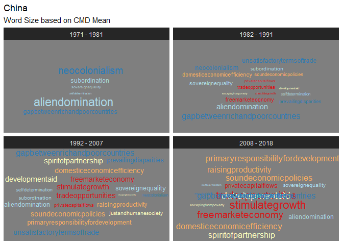
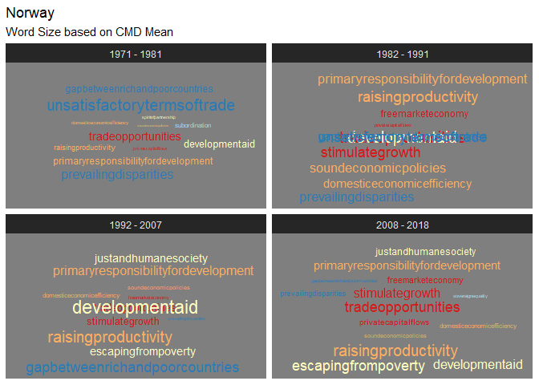
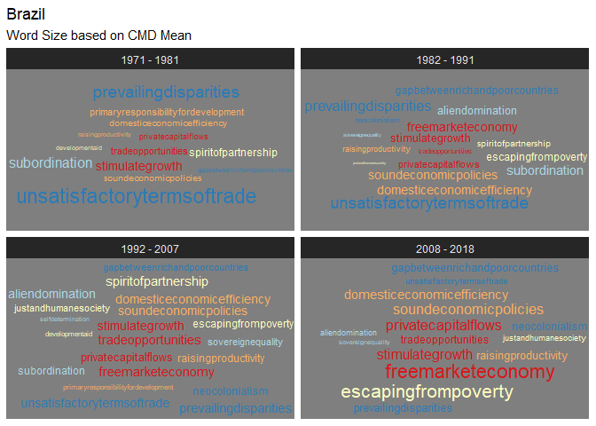
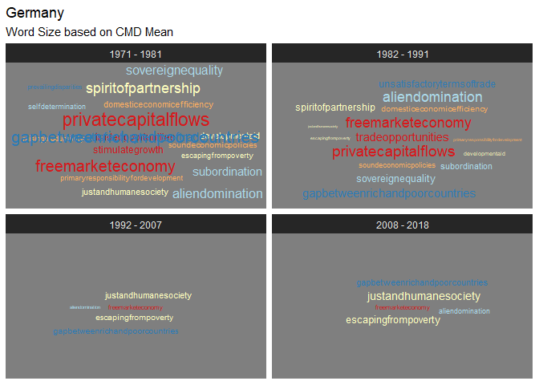

# 1) Library

``` r
pacman::p_load(tidyverse,tidytext, magrittr,ggwordcloud)
set.seed(42)
```

# 2) Load Data

``` r
# Load un_long ----
un_long <- read_csv("un_long.csv", col_types = cols(...1 = col_skip()))
```

    ## New names:
    ## * `` -> ...1

# Add interval and rhetorical strategy variables

``` r
# Add interval variable ----
wordcloud_data <- un_long %>%
  mutate(interval = case_when(
    year <= 1981 ~ "1971 - 1981",
    year >= 1982 & year <= 1991 ~ "1982 - 1991",
    year >= 1992 & year <= 2007 ~ "1992 - 2007",
    year >= 2008 ~ "2008 - 2018"
  ))

# Add rhetorical strategy variable ----
wordcloud_data %<>% 
  mutate(rhetoricalstrategy = case_when(
    cmd == "domesticeconomicefficiency" ~ "Domesticizing",
    cmd == "primaryresponsibilityfordevelopment" ~ "Domesticizing",
    cmd == "raisingproductivity" ~ "Domesticizing",
    cmd == "soundeconomicpolicies" ~ "Domesticizing",
    
    cmd == "developmentaid" ~ "Euphemizing",
    cmd == "escapingfrompoverty" ~ "Euphemizing",
    cmd == "justandhumanesociety" ~ "Euphemizing",
    cmd == "spiritofpartnership" ~ "Euphemizing",
    
    cmd == "freemarketeconomy" ~ "Liberalizing",
    cmd == "privatecapitalflows" ~ "Liberalizing",
    cmd == "stimulategrowth" ~ "Liberalizing",
    cmd == "tradeopportunities" ~ "Liberalizing",
    
    cmd == "gapbetweenrichandpoorcountries" ~ "Confronting",
    cmd == "neocolonialism" ~ "Confronting",
    cmd == "prevailingdisparities" ~ "Confronting",
    cmd == "unsatisfactorytermsoftrade" ~ "Confronting",
    
    cmd == "aliendomination" ~ "Claiming",
    cmd == "selfdetermination" ~ "Claiming",
    cmd == "sovereignequality" ~ "Claiming",
    cmd == "subordination" ~ "Claiming", 
    
    TRUE ~ "drop"
  ))

wordcloud_data %<>% filter(rhetoricalstrategy != "drop")

wordcloud_data$rhetoricalstrategy <- factor(wordcloud_data$rhetoricalstrategy, levels = c("Liberalizing", "Domesticizing", "Euphemizing", "Claiming", "Confronting"))
```

# Generate Word Clouds

``` r
# Guinea-Bissau ----
GNB_wordcloud <- wordcloud_data %>% 
  group_by(interval, iso, cmd, rhetoricalstrategy) %>% 
  mutate(intmean = mean(value)) %>% 
  filter(iso == "GNB") %>%
  distinct(intmean) %>% 
  arrange(interval, rhetoricalstrategy) %>%
  ggplot(mapping = aes(label = cmd, size = intmean, colour = rhetoricalstrategy)) +
  geom_text_wordcloud_area() +
  scale_color_brewer(palette = "RdYlBu") +
  theme_dark() +
  labs(title = "Guinea-Bissau", subtitle = "Word Size based on CMD Mean") +
  facet_wrap(vars(interval))

# China ----
CHN_wordcloud <- wordcloud_data %>% 
  group_by(interval, iso, cmd, rhetoricalstrategy) %>% 
  mutate(intmean = mean(value)) %>% 
  filter(iso == "CHN") %>%
  distinct(intmean) %>% 
  arrange(interval, rhetoricalstrategy) %>%
  ggplot(mapping = aes(label = cmd, size = intmean, colour = rhetoricalstrategy)) +
  geom_text_wordcloud_area() +
  scale_color_brewer(palette = "RdYlBu") +
  theme_dark() +
  labs(title = "China", subtitle = "Word Size based on CMD Mean") +
  facet_wrap(vars(interval))

# Norway ----
NOR_wordcloud <- wordcloud_data %>% 
  group_by(interval, iso, cmd, rhetoricalstrategy) %>% 
  mutate(intmean = mean(value)) %>% 
  filter(iso == "NOR") %>%
  distinct(intmean) %>% 
  arrange(interval, rhetoricalstrategy) %>%
  ggplot(mapping = aes(label = cmd, size = intmean, colour = rhetoricalstrategy)) +
  geom_text_wordcloud_area() +
  scale_color_brewer(palette = "RdYlBu") +
  theme_dark() +
  labs(title = "Norway", subtitle = "Word Size based on CMD Mean") +
  facet_wrap(vars(interval))

# Brazil ----
BRA_wordcloud <- wordcloud_data %>% 
  group_by(interval, iso, cmd, rhetoricalstrategy) %>% 
  mutate(intmean = mean(value)) %>% 
  filter(iso == "BRA") %>%
  distinct(intmean) %>% 
  arrange(interval, rhetoricalstrategy) %>%
  ggplot(mapping = aes(label = cmd, size = intmean, colour = rhetoricalstrategy)) +
  geom_text_wordcloud_area() +
  scale_color_brewer(palette = "RdYlBu") +
  theme_dark() +
  labs(title = "Brazil", subtitle = "Word Size based on CMD Mean") +
  facet_wrap(vars(interval))

# Germany ----
DEU_wordcloud <- wordcloud_data %>% 
  group_by(interval, iso, cmd, rhetoricalstrategy) %>% 
  mutate(intmean = mean(value)) %>% 
  filter(iso == "DEU") %>%
  distinct(intmean) %>% 
  arrange(interval, rhetoricalstrategy) %>%
  ggplot(mapping = aes(label = cmd, size = intmean, colour = rhetoricalstrategy)) +
  geom_text_wordcloud_area() +
  scale_color_brewer(palette = "RdYlBu") +
  theme_dark() +
  labs(title = "Germany", subtitle = "Word Size based on CMD Mean") +
  facet_wrap(vars(interval))
```

# Print word clouds

``` r
# Guinea-Bissau
GNB_wordcloud
```

    ## Warning in wordcloud_boxes(data_points = points_valid_first, boxes = boxes, :
    ## One word could not fit on page. It has been placed at its original position.

<!-- -->

``` r
# China ----
CHN_wordcloud
```

    ## Warning in wordcloud_boxes(data_points = points_valid_first, boxes = boxes, :
    ## Some words could not fit on page. They have been placed at their original
    ## positions.

    ## Warning in wordcloud_boxes(data_points = points_valid_first, boxes = boxes, :
    ## Some words could not fit on page. They have been placed at their original
    ## positions.

<!-- -->

``` r
# Norway ----
NOR_wordcloud
```

    ## Warning in wordcloud_boxes(data_points = points_valid_first, boxes = boxes, :
    ## One word could not fit on page. It has been placed at its original position.

    ## Warning in wordcloud_boxes(data_points = points_valid_first, boxes = boxes, :
    ## Some words could not fit on page. They have been placed at their original
    ## positions.

<!-- -->

``` r
# Brazil ----
BRA_wordcloud
```

<!-- -->

``` r
# Germany ----
DEU_wordcloud 
```

    ## Warning in wordcloud_boxes(data_points = points_valid_first, boxes = boxes, :
    ## One word could not fit on page. It has been placed at its original position.

<!-- -->
