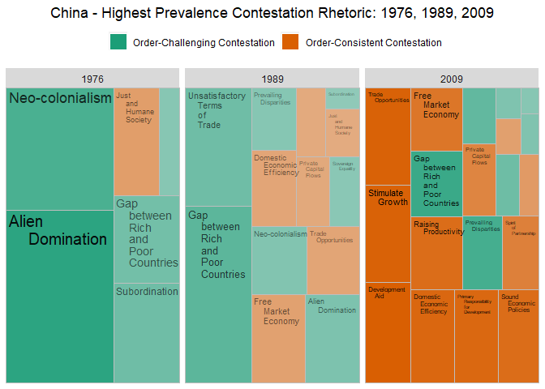
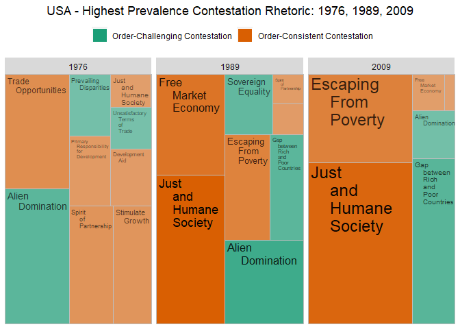

# 1) Library

``` r
pacman::p_load(tidyverse,tidytext, magrittr,ggwordcloud, treemapify)
set.seed(42)
```

# 2) Load Data

``` r
# Load un_long ----
un_long <- read_csv("un_long.csv", col_types = cols(...1 = col_skip()))
```

    ## New names:
    ## * `` -> `...1`

# 3) Prepare Data

``` r
# Add rhetorical strategy variable ----
wordcloud_data <- un_long %>%
  mutate(rhetoricalstrategy = case_when(
    cmd == "domesticeconomicefficiency" ~ "Domesticizing",
    cmd == "primaryresponsibilityfordevelopment" ~ "Domesticizing",
    cmd == "raisingproductivity" ~ "Domesticizing",
    cmd == "soundeconomicpolicies" ~ "Domesticizing",
    
    cmd == "developmentaid" ~ "Euphemizing",
    cmd == "escapingfrompoverty" ~ "Euphemizing",
    cmd == "justandhumanesociety" ~ "Euphemizing",
    cmd == "spiritofpartnership" ~ "Euphemizing",
    
    cmd == "freemarketeconomy" ~ "Liberalizing",
    cmd == "privatecapitalflows" ~ "Liberalizing",
    cmd == "stimulategrowth" ~ "Liberalizing",
    cmd == "tradeopportunities" ~ "Liberalizing",
    
    cmd == "gapbetweenrichandpoorcountries" ~ "Confronting",
    cmd == "neocolonialism" ~ "Confronting",
    cmd == "prevailingdisparities" ~ "Confronting",
    cmd == "unsatisfactorytermsoftrade" ~ "Confronting",
    
    cmd == "aliendomination" ~ "Claiming",
    cmd == "selfdetermination" ~ "Claiming",
    cmd == "sovereignequality" ~ "Claiming",
    cmd == "subordination" ~ "Claiming", 
    
    TRUE ~ "drop"
  ))

wordcloud_data %<>% filter(rhetoricalstrategy != "drop")

wordcloud_data$rhetoricalstrategy <- factor(wordcloud_data$rhetoricalstrategy, levels = c("Liberalizing", "Domesticizing", "Euphemizing", "Claiming", "Confronting"))


wordcloud_data %<>% 
  mutate(contestationstrategy = case_when(
    rhetoricalstrategy == "Domesticizing" | rhetoricalstrategy == "Euphemizing" | rhetoricalstrategy == "Liberalizing" ~ "Order-Consistent Contestation", 
    TRUE ~ "Order-Challenging Contestation"
  ))


# Add rhetorical strategy variable with spaces ----
wordcloud_data %<>%
  mutate(cmd_space = case_when(
    cmd == "domesticeconomicefficiency" ~ "Domestic 
    Economic
    Efficiency",
    cmd == "primaryresponsibilityfordevelopment" ~ "Primary 
    Responsibility 
    for 
    Development",
    cmd == "raisingproductivity" ~ "Raising 
    Productivity",
    cmd == "soundeconomicpolicies" ~ "Sound 
    Economic
    Policies",
    
    cmd == "developmentaid" ~ "Development 
    Aid",
    cmd == "escapingfrompoverty" ~ "Escaping 
    From 
    Poverty",
    cmd == "justandhumanesociety" ~ "Just 
    and 
    Humane 
    Society",
    cmd == "spiritofpartnership" ~ "Spirit 
    of 
    Partnership",
    
    cmd == "freemarketeconomy" ~ "Free 
    Market 
    Economy",
    cmd == "privatecapitalflows" ~ "Private 
    Capital 
    Flows",
    cmd == "stimulategrowth" ~ "Stimulate 
    Growth",
    cmd == "tradeopportunities" ~ "Trade 
    Opportunities",
    
    cmd == "gapbetweenrichandpoorcountries" ~ "Gap 
    between 
    Rich 
    and 
    Poor 
    Countries",
    cmd == "neocolonialism" ~ "Neo-colonialism",
    cmd == "prevailingdisparities" ~ "Prevailing 
    Disparities",
    cmd == "unsatisfactorytermsoftrade" ~ "Unsatisfactory 
    Terms 
    of 
    Trade",
    
    cmd == "aliendomination" ~ "Alien 
    Domination",
    cmd == "selfdetermination" ~ "Self-
    determination",
    cmd == "sovereignequality" ~ "Sovereign 
    Equality",
    cmd == "subordination" ~ "Subordination"
  ))
```

# 4) Generate tree maps

``` r
# GNB
GNB_treemap <- wordcloud_data %>% 
  filter(iso == "GNB") %>% 
  filter(year == 1976 | year == 1989 | year == 2009) %>% 
  group_by(iso, year, contestationstrategy) %>% 
  mutate(iso_year_contestationstrategy.mean = mean(value)) %>% 
  ggplot(mapping = aes(area = value, fill = contestationstrategy,
                       label = cmd_space, alpha = value)) + 
  scale_fill_brewer(palette = "Dark2") +
  geom_treemap() + 
  facet_wrap(vars(year)) + 
  geom_treemap_text(reflow = FALSE) + 
  labs(title = "Guinea-Bissau - Highest Prevalence Contestation Rhetoric: 1976, 1989, 2009") +
  theme(legend.position="top") + 
  theme(plot.title = element_text(hjust = 0.5)) +
  guides(fill=guide_legend(title=NULL)) +
  scale_alpha(guide = 'none')


# CHN
CHN_treemap <- wordcloud_data %>% 
  filter(iso == "CHN") %>% 
  filter(year == 1976 | year == 1989 | year == 2009) %>% 
  group_by(iso, year, contestationstrategy) %>% 
  mutate(iso_year_contestationstrategy.mean = mean(value)) %>% 
  ggplot(mapping = aes(area = value, fill = contestationstrategy,
                       label = cmd_space, alpha = value)) + 
  scale_fill_brewer(palette = "Dark2") +
  geom_treemap() + 
  facet_wrap(vars(year)) + 
  geom_treemap_text(reflow = FALSE) + 
  labs(title = "China - Highest Prevalence Contestation Rhetoric: 1976, 1989, 2009") +
  theme(legend.position="top") + 
  theme(plot.title = element_text(hjust = 0.5)) +
  guides(fill=guide_legend(title=NULL)) +
  scale_alpha(guide = 'none')

# NOR
NOR_treemap <- wordcloud_data %>% 
  filter(iso == "NOR") %>% 
  filter(year == 1976 | year == 1989 | year == 2009) %>% 
  group_by(iso, year, contestationstrategy) %>% 
  mutate(iso_year_contestationstrategy.mean = mean(value)) %>% 
  ggplot(mapping = aes(area = value, fill = contestationstrategy,
                       label = cmd_space, alpha = value)) + 
  scale_fill_brewer(palette = "Dark2") +
  geom_treemap() + 
  facet_wrap(vars(year)) + 
  geom_treemap_text(reflow = FALSE) + 
  labs(title = "Norway - Highest Prevalence Contestation Rhetoric: 1976, 1989, 2009") +
  theme(legend.position="top") + 
  theme(plot.title = element_text(hjust = 0.5)) +
  guides(fill=guide_legend(title=NULL)) +
  scale_alpha(guide = 'none')

# BRA
BRA_treemap <- wordcloud_data %>% 
  filter(iso == "NOR") %>% 
  filter(year == 1976 | year == 1989 | year == 2009) %>% 
  group_by(iso, year, contestationstrategy) %>% 
  mutate(iso_year_contestationstrategy.mean = mean(value)) %>% 
  ggplot(mapping = aes(area = value, fill = contestationstrategy,
                       label = cmd_space, alpha = value)) + 
  scale_fill_brewer(palette = "Dark2") +
  geom_treemap() + 
  facet_wrap(vars(year)) + 
  geom_treemap_text(reflow = FALSE) + 
  labs(title = "Brazil - Highest Prevalence Contestation Rhetoric: 1976, 1989, 2009") +
  theme(legend.position="top") + 
  theme(plot.title = element_text(hjust = 0.5)) +
  guides(fill=guide_legend(title=NULL)) +
  scale_alpha(guide = 'none')

# DEU
DEU_treemap <- wordcloud_data %>% 
  filter(iso == "DEU") %>% 
  filter(year == 1976 | year == 1989 | year == 2009) %>% 
  group_by(iso, year, contestationstrategy) %>% 
  mutate(iso_year_contestationstrategy.mean = mean(value)) %>% 
  ggplot(mapping = aes(area = value, fill = contestationstrategy,
                       label = cmd_space, alpha = value)) + 
  scale_fill_brewer(palette = "Dark2") +
  geom_treemap() + 
  facet_wrap(vars(year)) + 
  geom_treemap_text(reflow = FALSE) + 
  labs(title = "Germany - Highest Prevalence Contestation Rhetoric: 1976, 1989, 2009") +
  theme(legend.position="top") + 
  theme(plot.title = element_text(hjust = 0.5)) +
  guides(fill=guide_legend(title=NULL)) +
  scale_alpha(guide = 'none')
```

# 5) Print Treemaps

``` r
# Guinea-Bissau ----
GNB_treemap
```

<!-- -->

``` r
# China ----
CHN_treemap
```

<!-- -->

``` r
# Norway ----
NOR_treemap
```

<!-- -->

``` r
# Brazil ----
BRA_treemap
```

<!-- -->

``` r
# Germany ----
DEU_treemap
```

<!-- -->

# 6) Negative Cases

``` r
# Non-domesticators ----

# Cuba 
CUB_treemap <- wordcloud_data %>% 
  filter(iso == "CUB") %>% 
  filter(year == 1976 | year == 1989 | year == 2009) %>% 
  group_by(iso, year, contestationstrategy) %>% 
  mutate(iso_year_contestationstrategy.mean = mean(value)) %>% 
  ggplot(mapping = aes(area = value, fill = contestationstrategy,
                       label = cmd_space, alpha = value)) + 
  scale_fill_brewer(palette = "Dark2") +
  geom_treemap() + 
  facet_wrap(vars(year)) + 
  geom_treemap_text(reflow = FALSE) + 
  labs(title = "Cuba - Highest Prevalence Contestation Rhetoric: 1976, 1989, 2009") +
  theme(legend.position="top") + 
  theme(plot.title = element_text(hjust = 0.5)) +
  guides(fill=guide_legend(title=NULL)) +
  scale_alpha(guide = 'none')

CUB_treemap
```

<!-- -->

``` r
# Russia
RUS_treemap <- wordcloud_data %>% 
  filter(iso == "RUS") %>% 
  filter(year == 1976 | year == 1989 | year == 2009) %>% 
  group_by(iso, year, contestationstrategy) %>% 
  mutate(iso_year_contestationstrategy.mean = mean(value)) %>% 
  ggplot(mapping = aes(area = value, fill = contestationstrategy,
                       label = cmd_space, alpha = value)) + 
  scale_fill_brewer(palette = "Dark2") +
  geom_treemap() + 
  facet_wrap(vars(year)) + 
  geom_treemap_text(reflow = FALSE) + 
  labs(title = "Russia - Highest Prevalence Contestation Rhetoric: 1976, 1989, 2009") +
  theme(legend.position="top") + 
  theme(plot.title = element_text(hjust = 0.5)) +
  guides(fill=guide_legend(title=NULL)) +
  scale_alpha(guide = 'none')

RUS_treemap
```

<!-- -->

``` r
# Never Challenged ----

# USA
USA_treemap <- wordcloud_data %>% 
  filter(iso == "USA") %>% 
  filter(year == 1976 | year == 1989 | year == 2009) %>% 
  group_by(iso, year, contestationstrategy) %>% 
  mutate(iso_year_contestationstrategy.mean = mean(value)) %>% 
  ggplot(mapping = aes(area = value, fill = contestationstrategy,
                       label = cmd_space, alpha = value)) + 
  scale_fill_brewer(palette = "Dark2") +
  geom_treemap() + 
  facet_wrap(vars(year)) + 
  geom_treemap_text(reflow = FALSE) + 
  labs(title = "USA - Highest Prevalence Contestation Rhetoric: 1976, 1989, 2009") +
  theme(legend.position="top") + 
  theme(plot.title = element_text(hjust = 0.5)) +
  guides(fill=guide_legend(title=NULL)) +
  scale_alpha(guide = 'none')

USA_treemap
```

<!-- -->
